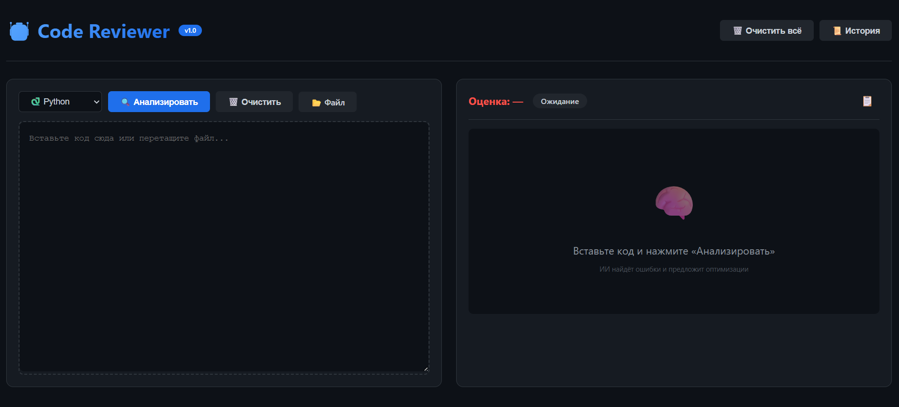
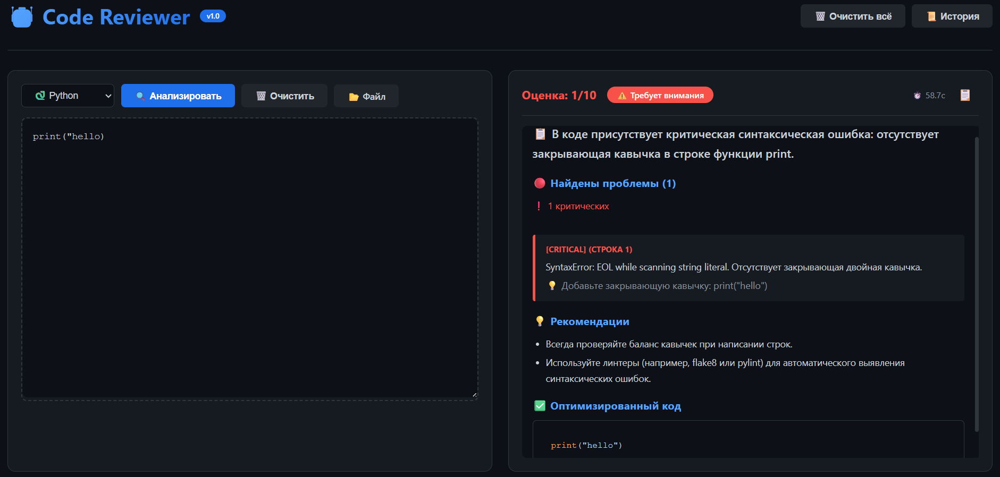
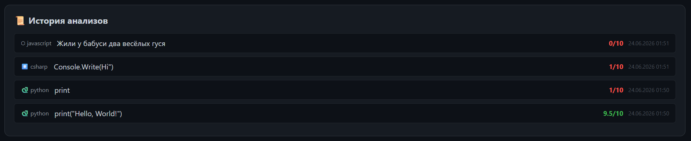

# AI Code Reviewer 1.0


### ИИ-ревьюер кода с подсветкой, историей и загрузкой файлов

Веб-приложение для анализа кода на Python, C#, JavaScript и Java. Нейросеть находит ошибки, оценивает качество и предлагает оптимизации.

---

## Оглавление

- [О проекте](#о-проекте)
- [Возможности](#возможности)
- [Скриншоты](#скриншоты)
- [Установка и запуск](#установка-и-запуск)
- [API эндпоинты](#api-эндпоинты)
- [Структура проекта](#структура-проекта)
- [Используемые технологии](#используемые-технологии)
- [Как работает анализ](#как-работает-анализ)
- [Надёжность](#надёжность)
- [Перспективы развития](#перспективы-развития)
- [Лицензия](#лицензия)

---

## О проекте

При разработке программного обеспечения разработчики часто тратят часы на поиск ошибок, которые можно найти автоматически. Code Review — важный, но трудоёмкий процесс, особенно в небольших командах.

Данный проект — это веб-приложение, которое:

- Анализирует код на Python, C#, JavaScript и Java
- Находит ошибки, баги и уязвимости
- Оценивает качество кода по шкале 0–10
- Предлагает оптимизированную версию
- Даёт рекомендации по лучшим практикам
- Хранит историю анализов в браузере

Приложение построено на FastAPI и использует бесплатную нейросеть Agnes AI для генерации структурированных отчётов. Интерфейс выполнен в тёмной теме, вдохновлённой GitHub.

---

## Возможности

### Основной функционал

- 🧠 **Анализ кода** на 4 языках: Python, C#, JavaScript, Java
- 📊 **Оценка качества** от 0 до 10 с цветовой индикацией
- 🐛 **Поиск ошибок** с указанием severity (critical, high, medium, low)
- 🔒 **Анализ безопасности** с рекомендациями
- 📝 **Генерация оптимизированного кода**
- 💡 **Советы по лучшим практикам** программирования
- 🎨 **Подсветка синтаксиса** с Highlight.js

### Удобство использования

- 📂 **Загрузка файлов** через drag & drop или кнопку
- ⌨️ **Горячие клавиши** — Ctrl+Enter для анализа
- 📜 **История анализов** в localStorage (до 50 записей)
- 📋 **Копирование результатов** одной кнопкой
- 📱 **Адаптивный дизайн** для всех устройств
- ⚡ **Индикатор прогресса** при анализе

### Команды и управление

| Элемент | Описание |
|---------|----------|
| Кнопка «Анализировать» | Запускает проверку кода |
| Кнопка «Очистить» | Очищает поле ввода |
| Кнопка «Файл» | Загружает файл с кодом |
| Кнопка «История» | Показывает/скрывает историю |
| Кнопка «Очистить всё» | Удаляет код, историю и результаты |
| Кнопка «📋» | Копирует результат анализа |

---

## Скриншоты

### Главный экран


### Результат анализа


### История


---

## Установка и запуск

### Требования

- Python 3.9 или выше
- pip (менеджер пакетов)
- API-ключ Agnes AI (получить на [platform.agnes-ai.com](https://platform.agnes-ai.com/))

### 1. Клонирование репозитория

```bash
git clone https://github.com/ArtemMac00/code-reviewer.git
cd code-reviewer
```

### 2. Установка зависимостей для бэкенда

```bash
cd backend
pip install -r requirements.txt
```

Файл `requirements.txt`:

```
fastapi==0.104.1
uvicorn==0.24.0
requests==2.31.0
python-dotenv==1.0.0
```

### 3. Настройка переменных окружения

Создай файл `.env` в папке `backend`:

```env
AGNES_API_KEY=sk-xxxxxxxxxxxxxxxxxxxxxxxxxxxxxxxxxxxxxxxx
MODEL=agnes-2.0-flash
```

### 4. Запуск бэкенда

```bash
python app.py
```

При успешном запуске в консоли появится сообщение:

```
INFO:     Started server process [12345]
INFO:     Waiting for application startup.
INFO:     Application startup complete.
INFO:     Uvicorn running on http://0.0.0.0:8000
```

### 5. Запуск фронтенда

Открой файл `frontend/index.html` в браузере или используй Live Server в VS Code.

---

## API эндпоинты

| Метод | Эндпоинт | Описание |
|-------|----------|----------|
| GET | `/` | Проверка работоспособности API |
| POST | `/analyze` | Анализ кода |

### POST /analyze

**Тело запроса:**

```json
{
  "code": "def hello():\n    print('Hello World')",
  "language": "python"
}
```

**Ответ:**

```json
{
  "summary": "Код простой и правильный, но есть стилистические улучшения",
  "score": 8.5,
  "issues": [
    {
      "severity": "low",
      "line": 1,
      "message": "Отсутствует пробел после двоеточия в сигнатуре функции",
      "suggestion": "Добавьте пробел: 'def hello():'"
    }
  ],
  "best_practices": [
    "Добавьте docstring для документации функции",
    "Используйте аннотации типов для аргументов"
  ],
  "optimized_code": "def hello() -> None:\n    \"\"\"Выводит приветствие.\"\"\"\n    print('Hello World')",
  "security": [
    "Код безопасен"
  ]
}
```

### Коды ответов

| Код | Описание |
|-----|----------|
| 200 | Успешный анализ |
| 400 | Код слишком короткий или пустой |
| 500 | Внутренняя ошибка сервера |

---

## Структура проекта

```
code-reviewer/
├── backend/
│   ├── app.py              # FastAPI сервер
│   ├── config.py           # Конфигурация (токены, модель)
│   ├── ai_service.py       # Логика работы с Agnes AI
│   ├── requirements.txt    # Зависимости
│   └── .env.example        # Пример .env файла
├── frontend/
│   ├── index.html          # Главная страница
│   ├── style.css           # Стили (тёмная тема)
│   └── script.js           # Логика фронтенда + история
└── README.md               # Документация
```

---

## Используемые технологии

| Компонент | Технология |
|-----------|------------|
| Язык | Python 3.9+ |
| Бэкенд | FastAPI, Uvicorn |
| Нейросеть | Agnes AI (agnes-2.0-flash) |
| HTTP-запросы | Requests |
| Переменные окружения | python-dotenv |
| Фронтенд | Vanilla JavaScript, CSS3 |
| Подсветка синтаксиса | Highlight.js |
| Хранение истории | localStorage |
| Drag & Drop | Нативная HTML5 API |
| Горячие клавиши | JavaScript Event Listeners |

---

## Как работает анализ

При отправке кода на анализ система выполняет следующие шаги:

1. **Получение кода** из текстового поля или загруженного файла
2. **Определение языка** (автоматически или вручную через выпадающий список)
3. **Формирование запроса** к Agnes AI с системным промптом:
   - Роль: эксперт по ревью кода с 10-летним стажем
   - Требование: вернуть структурированный JSON-отчёт
4. **Отправка запроса** через FastAPI-эндпоинт `/analyze`
5. **Обработка ответа** от нейросети:
   - Извлечение JSON из ответа
   - Парсинг полей: summary, score, issues, best_practices, optimized_code, security
6. **Сохранение** результата в историю (localStorage)
7. **Отображение** результата с подсветкой синтаксиса

### Системный промпт

Бэкенд использует следующий системный промпт для Agnes AI:

> *«Ты — эксперт по ревью кода с 10-летним стажем. Анализируй: ошибки и баги, производительность, читаемость и стиль, безопасность, возможные улучшения. Верни строгий JSON с полями summary, score, issues, best_practices, optimized_code, security»*

### Лимиты Agnes AI

- **20 запросов в минуту** — бесплатно
- Модель: `agnes-2.0-flash` — быстрая и умная
- Без привязки карты — полностью бесплатно

---

## Надёжность

В системе предусмотрены механизмы устойчивости к сбоям:

- При недоступности Agnes AI бэкенд возвращает структурированную ошибку
- Все ошибки обрабатываются с возвратом понятного JSON-ответа
- Внешние запросы имеют таймаут 60 секунд
- Фронтенд корректно обрабатывает ошибки сети и сервера
- История сохраняется в localStorage и не теряется при перезагрузке
- Корректная обработка длинных ответов (автоматическое форматирование)

---

## Перспективы развития

- Поддержка дополнительных языков (C++, Go, Rust, TypeScript)
- Интеграция с базами данных для облачного хранения истории
- Добавление экспорта отчётов в PDF и Markdown
- Возможность сравнения двух версий кода
- Метрики и статистика по анализам (графики)
- Поддержка больших файлов (до 1 МБ)
- Веб-интерфейс с регистрацией и авторизацией
- API для интеграции с CI/CD (GitHub Actions, GitLab CI)

---

## Лицензия

MIT License. Свободное использование, модификация и распространение.

---

## Контакты

- GitHub: [github.com/ArtemMac00](https://github.com/ArtemMac00)
- Telegram: [@artemii4ik](https://t.me/artemii4ik)
